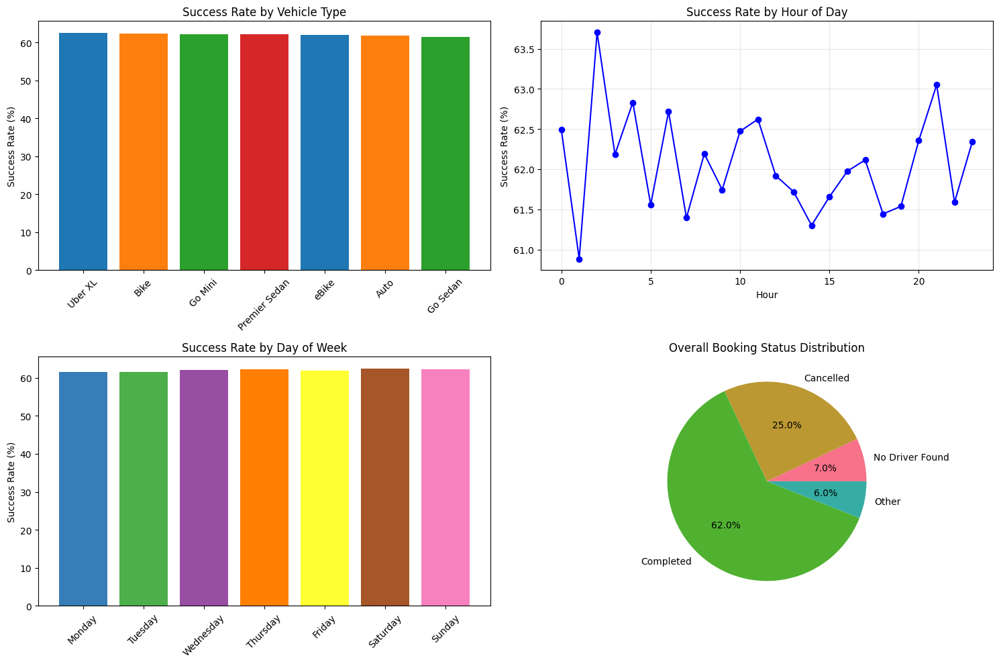
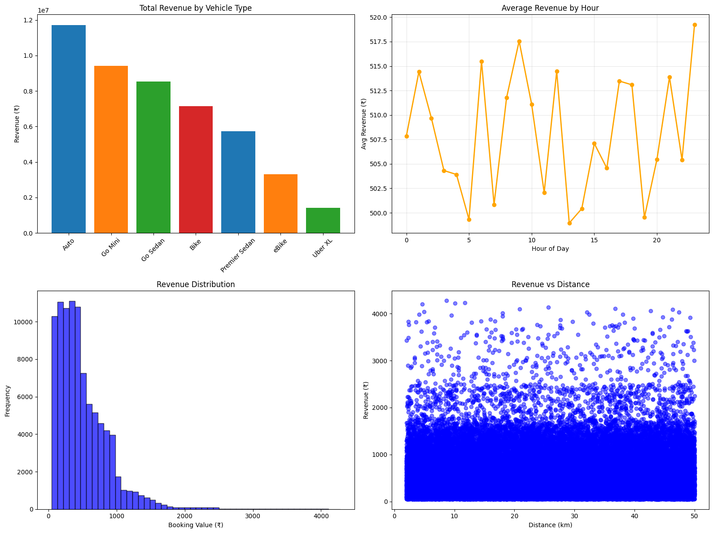
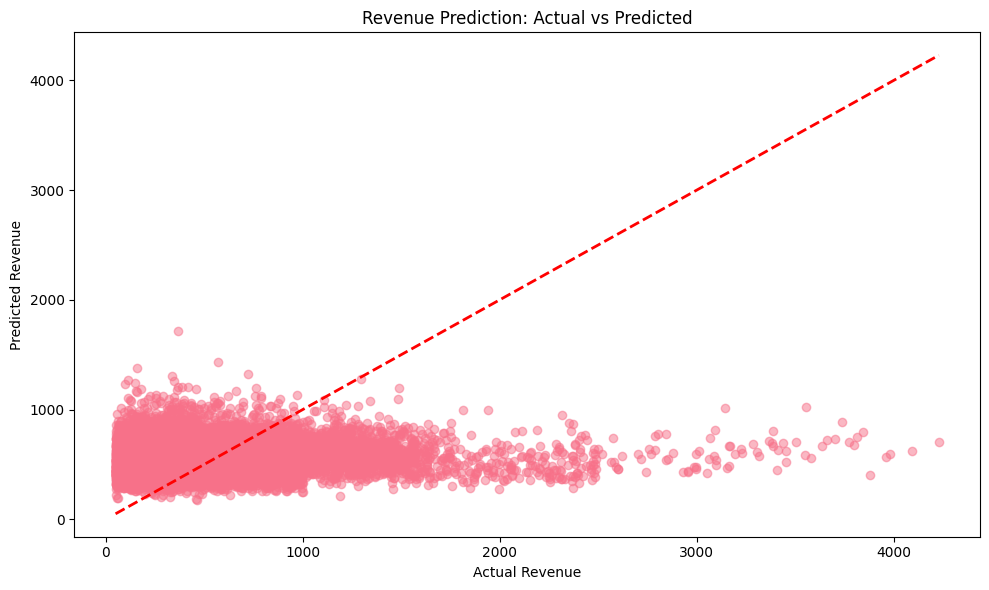
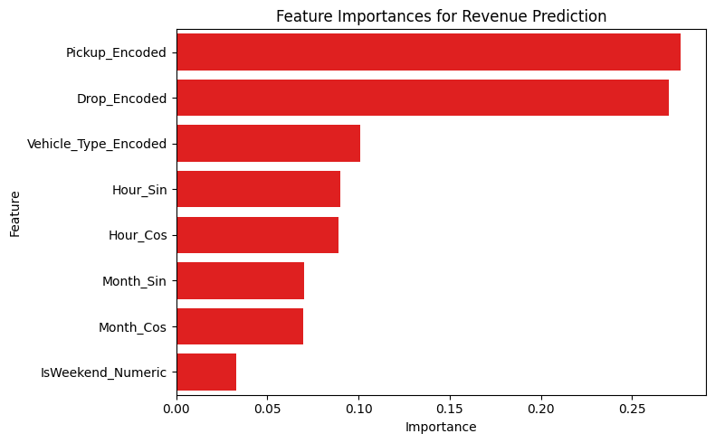

# NCR Ride Bookings Analysis & Revenue Prediction

## 🎓 Project Overview

**Research Question:**  
*"What factors influence ride success and revenue generation in NCR ride bookings?"*

This repository contains the **NCR Ride Bookings Analysis & Revenue Prediction** project. It analyzes ride booking data to uncover patterns in ride success, cancellations, and revenue, and builds a machine learning model to predict booking revenue from ride and temporal features. The project illustrates end-to-end data science workflows, including data cleaning, exploratory analysis, visualization, and machine learning.


## 📥 Dataset Source

The dataset analyzed in this project is publicly available on Kaggle:  
[https://www.kaggle.com/datasets/yashdevladdha/uber-ride-analytics-dashboard](https://www.kaggle.com/datasets/yashdevladdha/uber-ride-analytics-dashboard)

Thanks to @yashdevladdha for sharing this data on Kaggle!


## 📁 Project Files

```
ncr-ride-analysis/
├── Analysis.py             # Main data analysis and modeling script
├── Analysis.ipynb          # Detailed step-by-step Jupyter notebook walkthrough
├── Makefile                # Build automation and commands
├── ncr_ride_bookings.csv  # Dataset file (not included here)
├── README.md              # This documentation file
├── requirements.txt       # Python package dependencies (optional)
```

## ✨ Features

- Fast data loading and processing using **Polars**  
- Detailed **data cleaning** and missing value handling  
- Creation of time-based features and cancellation flags  
- Calculation of key business metrics such as ride success rate and revenue  
- Comprehensive **visualizations**:
  - Success rate breakdown by vehicle type, hour, and day of week  
  - Booking status distribution  
  - Revenue patterns by vehicle type and hour  
  - Revenue distribution and relationship to ride distance  
- **Machine Learning** model (Random Forest) for predicting ride revenue  
- Feature importance insights from the prediction model  


## ⚙️ Setup Instructions

### Prerequisites

- Python 3.7+ installed

### Installation

Install required Python packages from requirements.txt using the below command:
```
make install
```

### Run the analysis
```
make all
```

## 🚀 How to Run

Simply execute the analysis script:

```
make run
```

This will:

- Load and clean the data  
- Print summary statistics  
- Display interactive plots for key metrics and distributions  
- Train and evaluate a Random Forest regression model with output performance metrics and feature importance plots  


## 🔄 Analysis Workflow

1. **Data Loading & Cleaning**  
   - Handles null values related to cancellations naturally  
   - Removes duplicates  
   - Parses dates and times, deriving hour, weekday, month, and weekend flags  

2. **Business Metrics Computation**  
   - Success rate, 
   - Total Revenue
   - Average Revenue
   - Average Ride Distance
   - Average Driver Rating
   - Average Customer Ratings
   - Cancellations counts  

3. **Data Visualization**  
   - Success rate and cancellation patterns by vehicle type, time, and day  
   - Revenue distribution and dynamics relative to vehicle type and ride distance  

4. **Revenue Prediction Modeling**  
   - Builds cyclical time features and encodes categorical location and vehicle data  
   - Trains Random Forest regressor and reports R² and RMSE  
   - Visualizes actual vs predicted revenue and feature importances  


## 🔍 Key Findings
- Missing values appearing in columns like bookings, ratings, and payment methods are expected and consistent with ride cancellations and booking outcomes. Related columns such as cancellation flags and reasons appear mutually exclusively, logically reflecting event occurrence and context.  
- **Total rides:** 150,000  
- **Successful rides:** 93,000 (62% success rate)  
- **Total revenue (successful rides):** ₹47,260,574  
- **Average ride value:** ₹508.18  
- **Average ride distance:** 26 km  
- **Average ratings:** Drivers 4.23/5, Customers 4.40/5  
- **Cancellations:** Customers 10,500, Drivers 27,000 

## 📈 Visualizations

You will see the following plots during execution:
- Success Rate by Vehicle Type  
- Success Rate by Hour of Day  
- Success Rate by Day of Week  
- Booking Status Distribution (Pie Chart)  
- Total Revenue by Vehicle Type  
- Average Revenue by Hour  
- Revenue Distribution Histogram  
- Revenue vs Distance Scatter Plot  
- Actual vs Predicted Revenue Scatter Plot (ML Model)  
- Feature Importance Bar Chart (ML Model)  

### Success Rates


- The analysis reveals that success rates are highly consistent across all vehicle types, with Uber XL, Bike, and Go Mini showing the highest—though only marginally better—performance. 
- Completion rates for bookings are strong at 62%, with cancellations accounting for 25%. 
- Time of day and day of week have minimal impact on booking success rates, indicating stable performance throughout.

### Revenue Analysis


- Revenue analysis shows Auto generates the highest total revenue, with Go Mini and Go Sedan following. Uber XL yields the least revenue overall.  
- The average revenue per hour doesn’t change much throughout the day, staying mostly between ₹500 and ₹520, which means there aren’t any big peaks or drops in hourly earnings.
- Most individual bookings have lower values, as seen in the revenue distribution histogram, and high-value bookings are much less common.
- The revenue vs distance scatter plot shows that for any given distance, the revenue can vary a lot, so trip distance alone isn’t a strong predictor of revenue.

### Model's Performance


- Ideally, points should cluster along the diagonal dashed line (where predicted = actual).
- In the above plot, most points lie below the diagonal, suggesting the model frequently underpredicts high revenue values and compresses predictions for a majority of rides.
- The model predicts the lower and middle revenue band relatively well, but struggles with the high-value outliers (underfitting for expensive rides).
- Model Metrics (R**2 = -0.044, MSE= Rs 408.16) suggests that model is not performing good and further fine tuning is required.

### Feature Importance


- Location (pickup/drop-off) is the dominant predictor. This could reflect local fare structures, regional ride patterns, or neighborhood-level demand differences.
- Vehicle type and time features (hour, month) matter, but not as strongly.
- Weekend status is least important, indicating similar ride values regardless of weekday vs. weekend.

## ⚡ Conclusion

- **Ride success rates** are consistently high (around 62%) across all vehicle types (Uber XL, Bike, Go Mini, etc.), with only marginal differences among them, indicating that vehicle choice does not significantly impact whether a booking is completed.

- **Time of day and day of week have minimal effect on ride completion:** Success rates remain stable hourly and daily, suggesting operational reliability and no major rush-hour or weekend bottlenecks.

- Most **ride failures** are due to **cancellations (25%)**, with only a small proportion attributed to **"No Driver Found" or other causes (13% combined)**, highlighting the importance of customer and driver retention and experience.

- **Revenue is most strongly influenced by pickup and drop-off locations:** These are the top predictors in your Random Forest model, revealing that where a trip begins and ends has the largest impact on booking value, likely due to route length, zone-based pricing, and local demand.

- **Vehicle type** and **time features (hour, month)** also contribute to revenue differences, but to a lesser extent than location. Weekend status has little to no impact on booking value.

- **There is high variability in revenue even for similar trip distances:** Distance alone cannot reliably predict ride revenue, indicating the influence of other factors such as traffic, surge pricing, and trip-specific characteristics.

- The machine learning model predicts bulk ride revenues well but tends to underpredict rare high-value trips, suggesting potential for model refinement or the inclusion of additional features like dynamic pricing and ride type.


## 📚 Additional Resources

For a **detailed step-by-step walkthrough** of the complete data analysis and modeling process — including more thorough explanations, exploratory data analysis, visualizations, and detailed interpretation of results — please refer to the **`Analysis.ipynb` Jupyter Notebook** provided alongside the script.

This notebook offers:

- Interactive exploration of the dataset  
- Clear, annotated code cells demonstrating all cleaning, feature engineering, and modeling steps  
- Inline plots and visualizations for immediate insight  
- Detailed commentary on findings and their implications  

If you want a guided and interactive experience exploring the data and results visually, working through the `Analysis.ipynb` notebook is highly recommended.

## 📜 Author

- Author: PRANSHUL BHATNAGAR  
- Date: 08 September 2025  

